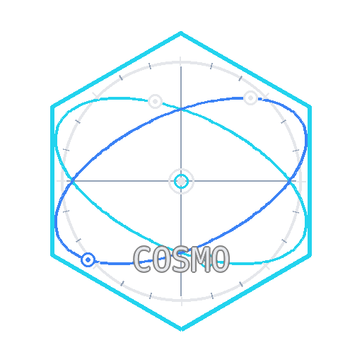
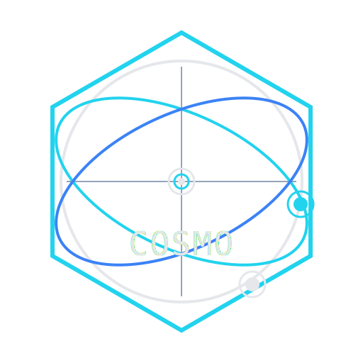

<p align="center">
  <picture>
    <source srcset="logo/cosmo_logo.svg" type="image/svg+xml">
    
  </picture>
</p>

<h1 align="center">COSMO OpenLABEL → Omega-Prime</h1>


<p align="center">
  Convert ASAM OpenLABEL annotations to Omega-Prime CSV, and optionally MCAP/OSI, with a Qt GUI.
</p>

> ⚠️ **Licensing notice:** The license for this repository is currently **TBD**.  
> Until finalized, **all rights are reserved**. See `LICENSE-TBD.md`.


OL2OP
=====

OL2OP is set of Python script to transform OpenLABEL files from SAVANT to Omega-Prime files.


Input:
* An OpenLABEL files
* An OpenDRIVE file
* An Calibration.json file to align the OpenLABEL and the OpenDRIVE file

The conversion is done running the file "convert_openlabel_to_omega.py"

`usage: convert_openlabel_to_omega.py [-h] --openlabel OPENLABEL [--odr ODR] --out-prefix OUT_PREFIX`
`                                     [--calibration CALIBRATION] [--fps FPS] [--no-csv] [--no-mcap]`

`OpenLABEL ➜ OSI (MCAP) + Omega-Prime CSV`

`options:`
`  -h, --help            show this help message and exit`
`  --openlabel OPENLABEL`
`                        Path to OpenLABEL JSON (e.g., Saro_roundabout.json)`
`  --odr ODR             Path to OpenDRIVE XML (or .txt containing XML)`
`  --out-prefix OUT_PREFIX`
`                        Output file prefix (no extension), e.g., Saro_roundabout`
`  --calibration CALIBRATION`
`                        Path to calibration.json with homography or camera model`
`  --fps FPS             Override FPS (if not given in calibration)`
`  --no-csv              Skip CSV writing`
`  --no-mcap             Skip MCAP writing`
  
  
  
  
The Calibration.json can be calibrated running either:

`02_compute_calibration.py`
 

or

`compute_calibration.py`

The seconda one offers option validation vs. the OpenLABEL.json.


03_validate_openlabel_with_calibration.py can be used for validation afterwards.

Depending on image size it may be necessary to rescale the point2pixel. That may be done using
01_rescale_pixel_pairs.py


# OL2OP PyQt6 GUI

This is a lightweight PyQt6 front-end for the **OpenLABEL + OpenDRIVE → Omega-Prime** converter.

It is intended to be used alongside the updated converter script **`convert_openlabel_to_omega.py`**.

## Files

- `ol2op_gui.py` — the GUI application.
- `convert_openlabel_to_omega.py` — the converter (run by the GUI as a subprocess).

## Install

```bash
pip install PyQt6
# Optional (only needed if you want MCAP output):
pip install betterosi
```

## Run

```bash
python ol2op_gui.py
```

## Notes

- The GUI stores your last-used paths and settings using `QSettings`.
- The GUI executes the converter using `sys.executable`, so it will use the same
  Python environment you launched the GUI with.
- If you want to embed the GUI into ORBIT, you can:
  - add a menu entry that launches this window, or
  - refactor the worker to import and call `convert_openlabel_to_omega()` directly.


# SAVANTPostProcessing
Temporary repro for experiments for SAVANT postprocessing

ISO 8855 for cooredinate systems is available here for RISE: https://www.sis.se/api/document/get/82643
A local copy for RSIE DTS is stored on our sharepoint: https://risecloud.sharepoint.com/:b:/r/sites/PlitligaTransportsystem/Delade%20dokument/Dokument/Standarder/SS_ISO_8855_2011_EN.pdf?csf=1&web=1&e=hDD4Eh

# Using ORBIT `xxx_georef_data.json` in `convert_openlabel_to_omega.py`

This note explains **how the ORBIT georeferencing export is used** to align OpenLABEL detections with an ORBIT-generated OpenDRIVE map, and **how to run the converter**.

> Scope: This describes the updated converter that supports `--georef-data` (ORBIT export) and keeps legacy `--calibration` support. citeturn2file51

---

## 1. Background: what the converter does

`convert_openlabel_to_omega.py` converts:

- **ASAM OpenLABEL** (object tracks with 2D rotated bounding boxes in pixels)
- plus an optional **OpenDRIVE** map

into:

- **Omega-Prime style CSV** (moving-object table)
- and optionally **MCAP** containing **OSI GroundTruth** (requires `betterosi`). citeturn2file51

The critical step is **projecting pixel coordinates** (the detection centers) to **ground-plane XY** so the trajectories are expressed in the same coordinate frame as the OpenDRIVE map. citeturn2file51

---

## 2. What ORBIT’s georef export contains

ORBIT’s `xxx_georef_data.json` (example: `ekas_visual_georef_data.json`) contains:

- `transform_method` (typically `"homography"`)
- `transformation_matrix` (3×3)
- `inverse_matrix` (3×3)
- `reference_point` (lat/lon anchor)
- `image_size`, `control_points`, and error metrics (`reprojection_error`, `validation_error`) citeturn1search1

In the example file, you can see both matrices are stored explicitly. citeturn1search1

### 2.1 Meaning of `transformation_matrix`

The converter treats ORBIT’s:

- `transformation_matrix` as the **pixel → local ground-plane** mapping (homography), i.e. it is used like `H` in:

```text
[X, Y, w]^T = H · [u, v, 1]^T
X = X/w, Y = Y/w
```

This is exactly what the converter’s updated alignment loader does when `--georef-data` is provided. citeturn2file51turn1search1

### 2.2 Meaning of `inverse_matrix`

ORBIT also provides the inverse mapping (`inverse_matrix`) which can be used for **local ground-plane → pixel** conversions (useful for debugging, overlays, and validation). citeturn1search1

The converter **does not need** `inverse_matrix` if `transformation_matrix` exists, but it will invert `inverse_matrix` as a fallback if only that one is present. citeturn2file51turn1search1

---

## 3. How the updated converter uses `--georef-data`

### 3.1 Input priority for the pixel→ground transform

The converter now loads alignment information in this priority order:

1. **ORBIT georef data** (`--georef-data`) if provided:
   - use `transformation_matrix` as `H` (preferred)
   - else use `homography` if present
   - else invert `inverse_matrix` to recover `H`
2. Else fall back to **legacy calibration** (`--calibration`):
   - use `homography` directly
   - or derive a planar homography from `intrinsics` + `extrinsics`

This behavior is implemented in `load_alignment(...)`. citeturn2file51turn1search1turn1search3

### 3.2 FPS and object size defaults

- **FPS** is read (in order) from georef → calibration → CLI `--fps` → default 30 Hz. citeturn2file51
- **Default object dimensions** (length/width/height) are read from calibration if available (e.g., `default_dimensions_m`). citeturn1search3turn2file51
- If no calibration is provided, the converter uses built-in defaults (cars, trucks, pedestrians, etc.). citeturn2file51

---

## 4. Coordinate frames and why ORBIT-generated OpenDRIVE “usually just works”

When both are generated from the **same ORBIT project**:

- ORBIT’s OpenDRIVE geometry and ORBIT’s georef transform are typically consistent because they share the same georeferencing session / control points and local frame definition. citeturn1search1turn2file51

That’s why, in the common workflow you described (OpenDRIVE generated by ORBIT), you typically only need `--georef-data` and no additional alignment parameters. citeturn2file51

---

## 5. How projection works inside the converter

For each OpenLABEL object in each frame:

1. Read rotated bbox: `[cx, cy, w_px, h_px, yaw_img]` in pixel coordinates. citeturn2file51
2. Project pixel center `(cx, cy)` using homography `H` from georef/calibration:

```python
X, Y = apply_homography(H, cx, cy)
```

3. Optionally apply **post alignment** (swap/flip/rotate/translate) if needed:

```python
X, Y = post_transform_xy(X, Y, swap_xy, flip_x, flip_y, yaw_offset_rad, xy_offset)
```

4. Use `(X, Y, Z=0)` as the object position in the CSV and OSI GroundTruth. citeturn2file51

Velocities and accelerations are estimated by finite differences using the configured FPS. citeturn2file51

---

## 6. How to run it (recommended commands)

### 6.1 Common case (ORBIT OpenDRIVE + ORBIT georef)

```bash
python convert_openlabel_to_omega.py \
  --openlabel path/to/labels.openlabel.json \
  --odr path/to/orbit_map.xodr \
  --georef-data path/to/xxx_georef_data.json \
  --out-prefix outputs/run1
```

This uses `transformation_matrix` from the ORBIT georef data as the pixel→ground homography. citeturn2file51turn1search1

### 6.2 Keep legacy calibration only for defaults (optional)

If you want to reuse `default_dimensions_m` (and/or `fps`) from a calibration file while still using ORBIT georef for projection:

```bash
python convert_openlabel_to_omega.py \
  --openlabel labels.openlabel.json \
  --odr orbit_map.xodr \
  --georef-data xxx_georef_data.json \
  --calibration calibration.json \
  --out-prefix outputs/run1
```

Calibration files typically include `fps`, `homography`, and `default_dimensions_m`. citeturn1search3turn2file51

### 6.3 Override FPS explicitly

```bash
python convert_openlabel_to_omega.py \
  --openlabel labels.openlabel.json \
  --odr orbit_map.xodr \
  --georef-data xxx_georef_data.json \
  --fps 30 \
  --out-prefix outputs/run1
```

`--fps` is used if neither georef nor calibration provides fps. citeturn2file51

---

## 7. Outputs

Given `--out-prefix outputs/run1`, the script writes:

- `outputs/run1.csv` (Omega-Prime moving-object table)
- `outputs/run1.mcap` (OSI GroundTruth in MCAP) if `betterosi` is available and `--no-mcap` is not used. citeturn2file51

The CSV includes integer codes for `type`, `subtype`, and `role`, plus readable `*_name` columns. citeturn2file51

---

## 8. Troubleshooting alignment (swap/flip/offset/rotation)

Even though ORBIT→ORBIT usually aligns, misalignment can happen if:

- OpenLABEL was produced from imagery that is **not the same stabilized/rectified image** used for ORBIT georef, or
- the OpenDRIVE comes from another pipeline with a different XY convention.

The updated converter provides optional post-transform flags:

- `--swap-xy` : swap X and Y
- `--flip-x`  : X := -X
- `--flip-y`  : Y := -Y
- `--yaw-offset-deg DEG` : rotate XY CCW by DEG
- `--xy-offset DX DY` : translate XY by (DX, DY) meters

These are applied **after** the homography projection. citeturn2file51

### 8.1 Practical debugging recipe

1. Run without any alignment flags.
2. If trajectories appear mirrored across an axis, try `--flip-x` or `--flip-y`.
3. If trajectories appear transposed, try `--swap-xy`.
4. If everything looks rotated, try `--yaw-offset-deg 90` or `--yaw-offset-deg -90`.
5. If everything is consistently shifted, estimate a translation and apply `--xy-offset DX DY`.

---

## 9. Notes on “X east / Y north”

You mentioned you *expect* X east / Y north but aren’t fully sure.

- With ORBIT-generated OpenDRIVE + ORBIT georef from the same project, the *relative* alignment is what matters most; the converter will output trajectories in that same local XY frame. citeturn1search1turn2file51
- If you later need to validate “east/north” in absolute terms, you can use `reference_point` (lat/lon) together with ORBIT’s local frame definition and compare to known map features. citeturn1search1

---

## 10. Quick reference

### Required inputs

- `--openlabel`: OpenLABEL JSON with per-frame object rbboxes. citeturn2file51

### Recommended inputs

- `--georef-data`: ORBIT `xxx_georef_data.json` with `transformation_matrix`. citeturn1search1turn2file51
- `--odr`: ORBIT OpenDRIVE file for embedding in MCAP (optional). citeturn2file51

### Optional inputs

- `--calibration`: legacy calibration (optional; provides fps/dimensions/homography). citeturn1search3turn2file51

---

## Appendix A: Example ORBIT georef keys to look for

In the ORBIT georef export you should find:

- `"transform_method": "homography"`
- `"transformation_matrix": [[...],[...],[...]]`
- `"inverse_matrix": [[...],[...],[...]]`
- `"reference_point": {"longitude": ..., "latitude": ...}` citeturn1search1


## License

**License: TBD (to be decided).**

This repository is intended to be made available under an open-source license, but the exact license is currently under discussion within the project consortium.

Until the license is finalized and a license file is added, all rights are reserved and no permission is granted to use, modify, or redistribute this code beyond what is permitted by applicable law.

See: `LICENSE-TBD.md`.


## Acknowledgements

This work has been developed within an EU-funded project in the same program context as the SAVANT tooling.

**Funding and consortium acknowledgement text: TBD**  
(Will be added once the final wording is confirmed by the consortium.)

## License

**License: TBD (under review).**

Until the licensing terms are finalized and a license is published in this repository, **all rights are reserved** and no permission is granted to use, modify, or redistribute this code beyond what is permitted by applicable law.

See: `LICENSE-TBD.md`.
``


# COSMO — OpenLABEL → OSI/MCAP + Omega-Prime CSV (with GUI)

COSMO is a small toolset for converting ASAM OpenLABEL annotations into:
- **Omega-Prime compatible CSV** (moving-object table), and optionally
- **MCAP containing ASAM OSI GroundTruth**, optionally bundled with an OpenDRIVE map. [3](https://huggingface.co/DavidAU/Qwen3-48B-A4B-Savant-Commander-Distill-12X-Closed-Open-Heretic-Uncensored-GGUF/blob/main/README.md)[1](https://opensource.stackexchange.com/questions/11970/is-license-mentioned-in-readme-enough)

The recommended entry point is the **COSMO Converter GUI**, which wraps the conversion script and provides a calibration helper tab. [1](https://opensource.stackexchange.com/questions/11970/is-license-mentioned-in-readme-enough)

---

## Quick start (GUI)

### 1) Create environment (Conda, recommended for internal use)
```bash
conda env create -f environment.yml
conda activate cosmo


<p align="center">
  <picture>
    <source srcset="logo/cosmo_logo.svg" type="image/svg+xml">
    
  </picture>
</p>

<h1 align="center">COSMO OpenLABEL → Omega-Prime</h1>

<p align="center">
  Convert ASAM OpenLABEL annotations to Omega-Prime CSV, and optionally MCAP/OSI, with a Qt GUI.
</p>

> ⚠️ **Licensing notice:** The license for this repository is currently **TBD**.  
> Until finalized, **all rights are reserved**. See `LICENSE-TBD.md`.  
> (When making a repository “truly open source”, GitHub recommends including a license file; without one, default copyright rules apply.) [2](https://codesandbox.io/)

---

## Screenshots

> **Add your screenshot here:** place a PNG at `docs/images/cosmo_gui.png` and it will render below.

<p align="center">
  
</p>

**Tip:** Keep screenshots reasonably small (e.g., 150–400 KB) to avoid bloating the repo. Large recordings/videos/MCAP should remain untracked.

---

## Overview

COSMO provides a GUI-first workflow for converting ASAM OpenLABEL annotations into:
- **Omega-Prime compatible CSV** (moving-object table), and optionally
- **MCAP containing ASAM OSI GroundTruth** (requires optional dependency). [3](https://huggingface.co/DavidAU/Qwen3-48B-A4B-Savant-Commander-Distill-12X-Closed-Open-Heretic-Uncensored-GGUF/blob/main/README.md)[1](https://opensource.stackexchange.com/questions/11970/is-license-mentioned-in-readme-enough)

The GUI wraps the conversion script and also provides a calibration helper tab. [1](https://opensource.stackexchange.com/questions/11970/is-license-mentioned-in-readme-enough)

---

## Quick start (GUI)

### 1) Create environment (Conda, recommended for internal use)
```bash
conda env create -f environment.yml
conda activate cosmo