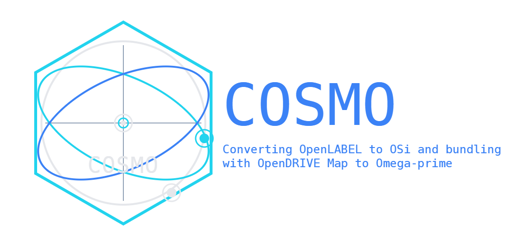
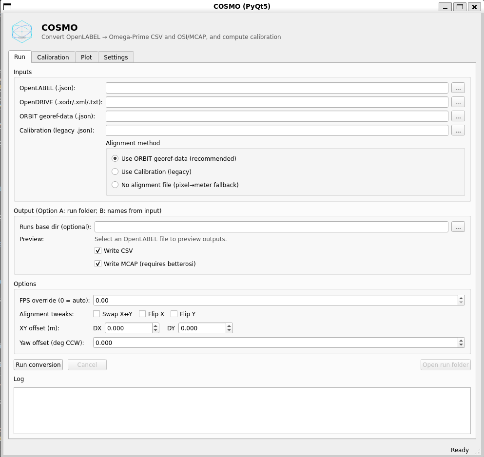

<p align="center">
  <picture>
    <source srcset="docs/images/cosmo_logo_with_text.drawio.svg" type="image/svg+xml">
    
  </picture>
</p>

# COSMO - OpenLABEL + OpenDRIVE → Omega‑Prime

[](https://github.com/MickOls/COSMO/actions/workflows/ci.yml)
[](https://www.gnu.org/licenses/gpl-3.0)

[](https://www.asam.net/standards/detail/opendrive/)
[](https://www.asam.net/standards/detail/openlabel/)
[](https://github.com/ika-rwth-aachen/omega-prime)

COSMO converts **ASAM OpenLABEL** annotations into:

- **Omega‑Prime compatible CSV** (moving-object table)
- optionally **MCAP** containing **ASAM OSI GroundTruth**, optionally bundled with an **OpenDRIVE** map.



> [!NOTE]
> This is a beta version. Bugs and missing features should be expected. Github issues can be added for bug reports or feature requests.

> Maintained by **RISE Research Institutes of Sweden**. Developed in the SYNERGIES project.

---
## Documentation (quick links)
- [Docs index](docs/README.md)
- [Quickstart](docs/getting-started/quickstart.md)
- [CLI](docs/user_guide/cli.md)
- [Outputs (CSV/MCAP)](docs/reference/outputs-omega-prime.md)
- [Troubleshooting](docs/how-to/troubleshooting.md)
---
## Quick start (recommended: ORBIT georef)

Install (editable + dev tools). Recommended with **uv** (the project ships a `uv.lock`):
```bash
uv sync --group dev          # or --all-groups for gui/mcap/plot/etc.
```

With **pip** (≥ 25.1, which understands `[dependency-groups]`):
```bash
python -m pip install -U pip
python -m pip install -e . --group dev
```
> Note: `[dependency-groups]` (dev, gui, mcap, …) are not pip *extras*, so
> `pip install -e ".[dev]"` does **not** work. CI installs the base package plus
> tools explicitly: `pip install -e . pytest ruff` (adding `betterosi mcap` for
> MCAP integration tests).

> Tip 1: The **GUI** is launched with `cosmo` or `cosmo gui`.
> Tip 2: In headless environments, prefer explicit subcommands such as `cosmo convert ...` rather than plain `cosmo`, which may start the GUI.

Convert using [ORBIT](https://github.com/RI-SE/ORBIT) georef as the primary pixel→ground mapping (**Convert** tab in the **GUI**):

```bash
cosmo convert scenario.json \
  --georef-data path/to/*_georef_data.json \
  --odr path/to/map.xodr \
  -o runs/
```

This creates a per-run folder (default base runs/) with:
- outputs/<base_name>.csv
- outputs/<base_name>.mcap (if enabled + betterosi installed)
- run_inputs.json, run_summary.json

> Tip: in some setups, running plain cosmo (no args) may start the GUI; use subcommands in headless environments.

#### Backup workflow: calibration.json (when ORBIT georef is unavailable)
Compute calibration (pixel→ground homography):

```bash
cosmo calibrate --inputs pixel_pairs.csv visual_markers.csv map.xodr -o runs/
```
Calibration outputs are written to outputs/ as:
- <base_name>_calibration.json
- <base_name>_homography_fit_summary.json
- <base_name>_homography_fit_residuals.png
- <base_name>_overlay_markers_on_image.png (only if --image is provided)

Use the calibration file for conversion fallback:

```bash
cosmo convert scenario.json \
  --calibration runs/<calibrate_run>/outputs/<base_name>_calibration.json \
  -o runs/
```
---
## Optional preprocessing: correct oblique-drone bboxes

For footage from an oblique (tilted) drone camera, object bounding boxes are
geometrically distorted. `cosmo correct` rewrites an OpenLABEL file into a
corrected OpenLABEL file before conversion:

```bash
cosmo correct scenario.json \
  --georef-data path/to/*_georef_data.json \
  --flight-record path/to/FlightRecord_*.video_stats.json \
  -o scenario_corrected.json
```

Then feed the corrected file to `cosmo convert`. Key options:
- `--georef-data` / `--calibration`: pixel→ground mapping (one is required).
- `--flight-record` (required): drone/camera pose per frame.
- `--bbox-correction {analytical,3d}`: correction mode (default: analytical).
- `--output-coords {pixel,geo,both}`: corrected pixel rbbox (default), world cuboid, or both.
- `--stabilize-size`: replace per-frame dimensions with the per-object average.

---
## Trajectory explorer (visual inspection)

`trajectory-explorer` is a standalone Qt viewer for inspecting and comparing
object trajectories over an OpenDRIVE map. It loads up to three sources at once
(CSV, MCAP, or OpenLABEL JSON), so you can compare e.g. raw vs corrected output.

```bash
trajectory-explorer \
  --xodr path/to/map.xodr \
  --a runs/<run>/outputs/<base_name>.csv \
  --b path/to/scenario_corrected.json
```

It needs the GUI dependencies (PyQt5); install its dependency group with
`uv sync --group trajectory-explorer`. Slots `--a/--b/--c` each accept a
`.csv`, `.mcap`, or `.json` file.

---
## Documentation (start here)

* 📌 [Docs index](docs/README.md)
* Getting started:
  - [Quickstart](docs/getting-started/quickstart.md)
* User guide:
  - [CLI reference](docs/user_guide/cli.md)
  - [Workflow overview](docs/user_guide/workflow.md)
* How-to:
  - [Create and use calibration](docs/how-to/calibration.md)
  - [Troubleshooting](docs/how-to/troubleshooting.md)
* Reference:
  - [OpenLABEL input](docs/reference/inputs-openlabel.md)
  - [OpenDRIVE input](docs/reference/inputs-opendrive.md)
  - [Outputs (CSV/MCAP)](docs/reference/outputs-omega-prime.md)
  - [OSI/MCAP topics](docs/reference/osi-mcap.md)
* Developer guide:
  - [Georef pipeline](docs/developer_guide/georef-pipeline.md)
  - [Testing](docs/developer_guide/tests.md)

---

## OSI/MCAP notes

* MCAP output requires betterosi. If MCAP is requested but betterosi is missing, COSMO logs that it will write CSV only.
* MCAP topics written:
  - ground_truth_map (OpenDRIVE, if provided)
  - ground_truth (OSI GroundTruth per frame)

---

## Status and License

- Beta.
- COSMO is licensed under the [GNU General Public License v3.0 (GPL-3.0)](LICENSE).

## Acknowledgement
<br><div align="center">
  
</div>

This package is developed as part of the [SYNERGIES](https://synergies-ccam.eu/) project.

<br><div align="center">
  
</div>

Funded by the European Union. Views and opinions expressed are however those of the author(s) only and do not necessarily reflect those of the European Union or European Climate, Infrastructure and Environment Executive Agency (CINEA). Neither the European Union nor the granting authority can be held responsible for them.
